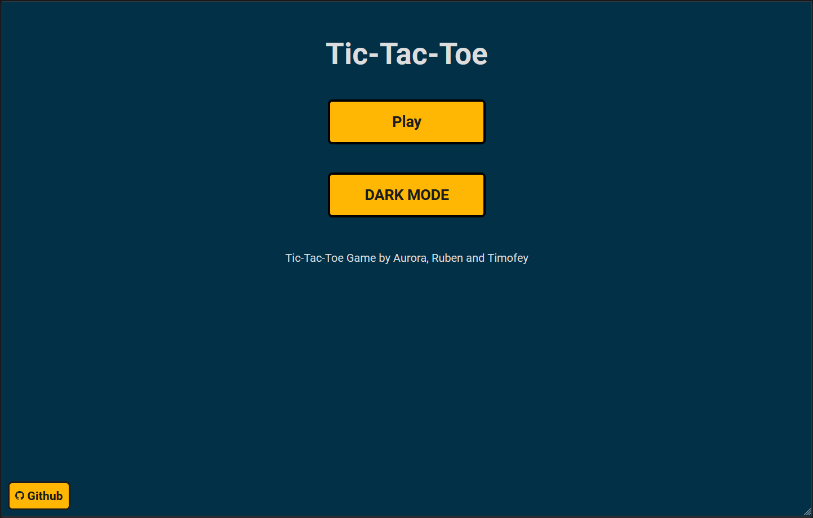
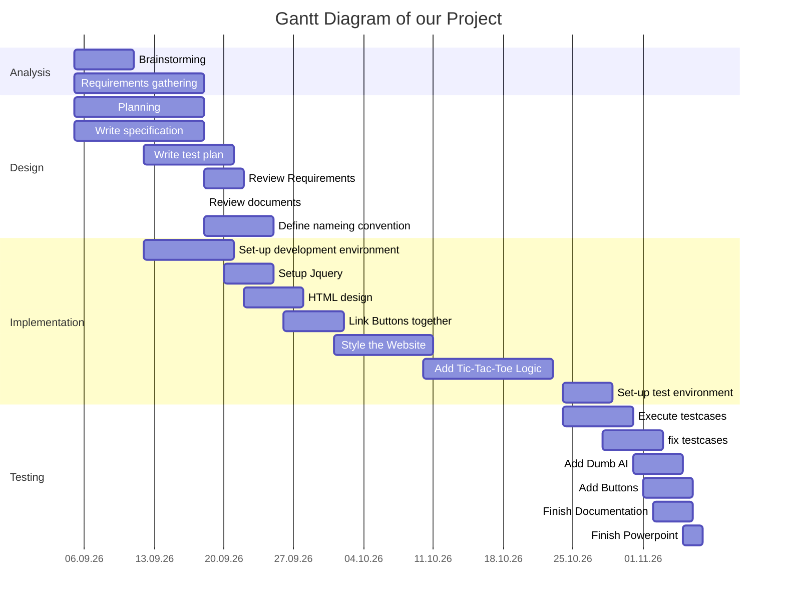
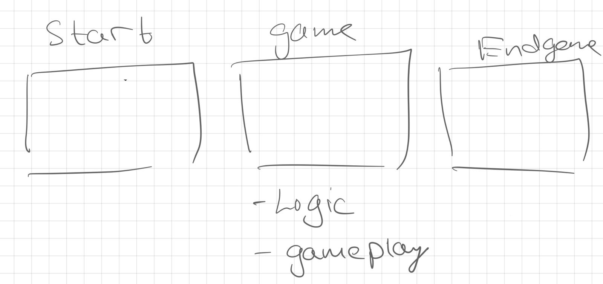

# Tic Tac Toe Webiste

  

## The [Website](https://tic-tac-toe-website.vercel.app/)

---

## Contributers

This Project was made by Aurora, Ruben and Timofey

---

## Table of contents

- [Introduction](#introduction)
- [Information](#information)
- [Decision](#decision)
  - [Decision Matrix](#decision-matrix)
- [Planning](#planning)
  - [Resource Plan](#resource-plan)
  - [Task List](#task-list-todo)
  - [Gantt Diagramm](#gantt-diagramm)
- [Realization](#realization)
- [Checking](#checking)
- [Assessment](#assessment)
  - [The Good](#the-good)
  - [difficulty](#the-difficult)
  - [The Improvements](#improvements)
    - [The technicality](#technical)

To the [Docs](https://github.com/Timofey-Makhankov/Tic-Tac-Toe-Website/tree/main/docs) Folder. There is:

- Powerpoint
- All Github Issues as a .CSV File
- Assignment Brief

---

## Introduction

We are a group of three who make a Tic-Tac-Toe website with the IPERKA system.
The IPERKA system are different easy steps to follow while making a projekt. The first task in IPERKA is to get informations. The second step is to plan your projext. Then you have to make some decisions about diffrent parts in your projekt. The you can realize your project. If you think you're done, you have to check if your project is working or if it have bugs in it. If it have bugs you have to fix them. If the project is done you have to evaluate what you did well or what you can make better next time.

---

## Information

At the beginning we had no idea what we should do. After some examples from our teacher we wanted to made code a calculator. We searched some informations about how to make a calculater but it is very complicated so we decided to make another project. Timofey had the idea to make a Tic-Tac-Toe game on a website and we agreed. Under Sources you can see the links to which we did reasearch.

This [Link](https://mikkegoes.com/javascript-projects-for-beginners/) was the inspiration for the Tic-Tac-Toe Website.

Sources:

[Tic-Tac-Toe Wikipedia](https://en.wikipedia.org/wiki/Tic-tac-toe)

[Youtube Video](https://www.youtube.com/watch?v=CQZxeoQeo5c) on how to create a simple Website.

[Hosting providers](https://www.wpbeginner.com/showcase/best-free-website-hosting-compared/) as comparison, but on further investigation we found a diffrent service that was suitable for our case called [Vercel](https://vercel.com/about)

---

## Decision

The first and most inportant point is the decision who does which task.

- Aurora - User-Interface with HTML & CSS
- Timofey - The backend with Javascript & J-Query
- Ruben - Writes the documentation and does the testing

We will also help each other if we need some help. Aurora decided to make the design with HTML and CSS because it's the only programming language she knows for frontend stuff. Timofey Decided to work with Java because he already did some stuff with Java and he uses J-Query to help him to not write so much code. Ruben decided to write in a ReadMe file in our github, because everyone can change something in this file and it's easy for everyone to write in.

### Decision Matrix

  

---

## Planning

We started to give each of us some tasks we have to work at. We also made a Docs file with the keydates of the project, the milestones, the To-Do list, the requirements and the description of the project.

Key Dates (Deadlines):

- 01.10.2022 - Submit Project Brief
- 05.11.2022 - Finish the learning Journal
- 06.11.2022 - Submit final project Document
- 07.11.2022 - project presentation

Information:
After some Research, We have decided on using Vercel. Because It’s free for hobbyists and is able to deploy with Javascript and not a static HTML Site.

Milestones:

- Finish the planning
- Having a well looking design
- Complete the coding phase
- Publish the Website
- Finish testing phase
- Having a working game
- The project is done

Criteria:

- To be able to use the Website and play the Game
- to see the website on diffrent screen sizes (Mobile-phone, Tablet & Laptop)
- To ahve a pleasing design for the website

Decision / Log:

- You can check on decisions on [Github](https://github.com/Timofey-Makhankov/Tic-Tac-Toe-Website/issues) or on a CSV File on this [link](./Docs/)

### Resource Plan

- Timofey:

1. code the Logic for the Game on the Website -> 2 Weeks
2. Co-Designer for the Website -> 1 Week

- Ruben:

1. write the documentation for the project -> The Whole Project Time
2. todo the testing for the Website -> 2 Weeks

- Aurora:
  
1. Web Designer for the Website -> 3 Weeks
2. Powerpoint preperation -> 3 Days

#### Task List (TODO)

- Timofey:

1. Get Javascript working with HTML and CSS
2. Make a Game Loop

- Ruben:

1. Finish writing the ReadMe sheet
2. Helping aurora make the website

- Aurora:

1. Make a good looking website (i.e. Good UI)
2. Create the Powerpoint for the Project

Requirements:
Be able to play the Game with CP (a Computer)
Be able to replay
Display user Score
Be able to access it from every device (Smartphone, Laptop, Ipad etc.)

Descriptions:
Tic Tac Toe - The Game:
Tic Tac Toe (Noughts and Crosses or Xs and Os) Is a Paper drawn Game, where two players make a 3x3 Grid and draw either an X or an O. The winner is chosen, whoever can make in the Grid a Row of either three Xs or Os. Most of the Time though, it will come to a draw.

### Gantt Diagramm

---

## Realization

To realize this project. We started simple: try to host a static HTML File on the local Network. After that create an Idea of how it might look like. We made a sketch drawing of it.

The sketch:

  

We started to make the structure of the website with HTML. We then checked if the CSS Fiule would connect to the HTMl Files. We then started to create the stylesheets for the HTML files. We periodically checked the locally hosted website for the changes.

If the Outcome wasn't desired, we would try to resolve it.

Some Examples are:

- The button wasn't centered
- a button event wasn't executing
- wrong color and/or size

The next step was to implement Logic to the website with Javascript.

## Checking

## Assessment

As a team, we have talked about how the project went. What was the good, the difficult and what we can improve in the future.

### The Good

- We were able to make a project into reality
- Our Teamwork was good
- if we had some difficulties, we helped eachother
- we were very motiviated to finish the project.

### The Difficult

- Our time managment wasn't great. there were some deadlines that were overdue.
- Our planning wasn't really thought-through. We only had a rough idea of what we wanted to do.
- Some of the work distribution wasn't ideal.
- One of the tools we weren't able to use, because we had low knowladge and didn't have time to learn it.

### Improvements

- Next time, we will make time managment a priority.
- we will improve the work distribution. So that everyone is happy with what they are supposed to do.

#### Technical

- when working on a version control, we will use a diffrent Branch (dev) instead of using the main (master) Branch. Use the main Branch as the release branch.
- create a project, with the tools you **know**. And don't try to learn a new Tool in the middle of the Project.

gh issue list --limit 1000 --state all | tr '\t' ',' > issues.csv
