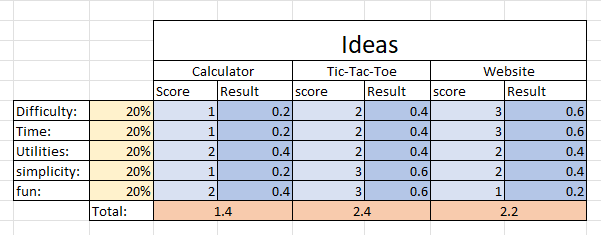

# Tic Tac Toe Webiste

---

## By

- Timofey
- Ruben
- Aurora

---

## Table of contents

1. Introduction
2. Information
3. Decision
4. Planning
5. Realization
6. Checking
7. Evaluation

---

## Introduction

We are a group of three who make a Tic-Tac-Toe website with the IPERKA system.
The IPERKA system are different easy steps to follow while making a projekt. The first task in IPERKA is to get informations. The second step is to plan your projext. Then you have to make some decisions about diffrent parts in your projekt. The you can realize your project. If you think you're done, you have to check if your project is working or if it have bugs in it. If it have bugs you have to fix them. If the project is done you have to evaluate what you did well or what you can make better next time.

---

## Information

At the beginning we had no idea what we should do. After some examples from our teacher we wanted to made code a calculator. We searched some informations about how to make a calculater but it is very complicated so we decided to make an other project. Timofey had the idea to make a Tic-Tac-Toe game on a website and we agreed. After a quick research we knew how to do it.

---

## Decision

The first and most inportant point is the decision, who does which task. We decided, that Aurora will do the userinterface in HTML and CSS, Timofey will do the backend programming with Java and J-Query and Ruben will do the text for the ReadMe file and make the final tests. We will also help each other if we need some help. Aurora decided to make the design with HTML and CSS because it's the only programming language she knows for frontend stuff. Timofey Decided to work with Java because he already did some stuff with Java and he uses J-Query for helping him to not write so much code. Ruben decide to write in a ReadMe file in our github, because everyone can change something in this file and it's easy for everyone to write in.

---

## Planning

We started to give each of us some tasks we have to work at. We also made a Docs file with the keydates of the project, the milestones, the To-Do list, the requirements and the description of the project.

[Google Document Link](https://docs.google.com/document/d/1Q76CZHwCyf05I1FYw0I5LlIXezh8ZpCCi-Iak7Qj9XI/edit)

---

## Realization

