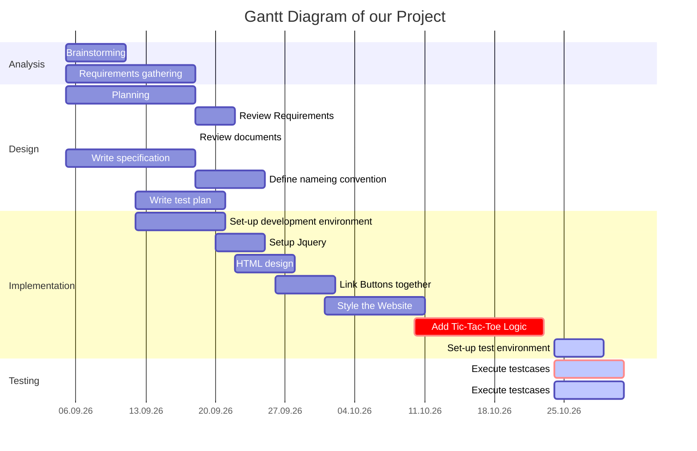

# Tic Tac Toe Webiste

  

[Website](https://tic-tac-toe-website.vercel.app/)
---

---

## Contributers

This Project was made by Aurora, Ruben and Timofey

---

## Table of contents

- [Information](#information)
- [Decision](#decision)
- [Planning](#planning)
  - [Gant Diagramm](#gant-diagramm)
- [Realization](#realization)
- [Checking](#checking)
- [Evaluation](#evaluation)

---

## Introduction

We are a group of three who make a Tic-Tac-Toe website with the IPERKA system.
The IPERKA system are different easy steps to follow while making a projekt. The first task in IPERKA is to get informations. The second step is to plan your projext. Then you have to make some decisions about diffrent parts in your projekt. The you can realize your project. If you think you're done, you have to check if your project is working or if it have bugs in it. If it have bugs you have to fix them. If the project is done you have to evaluate what you did well or what you can make better next time.

---

## Information

At the beginning we had no idea what we should do. After some examples from our teacher we wanted to made code a calculator. We searched some informations about how to make a calculater but it is very complicated so we decided to make an other project. Timofey had the idea to make a Tic-Tac-Toe game on a website and we agreed. After a quick research we knew how to do it.

---

## Decision

The first and most inportant point is the decision, who does which task. We decided, that Aurora will do the userinterface in HTML and CSS, Timofey will do the backend programming with Java and J-Query and Ruben will do the text for the ReadMe file and make the final tests. We will also help each other if we need some help. Aurora decided to make the design with HTML and CSS because it's the only programming language she knows for frontend stuff. Timofey Decided to work with Java because he already did some stuff with Java and he uses J-Query for helping him to not write so much code. Ruben decide to write in a ReadMe file in our github, because everyone can change something in this file and it's easy for everyone to write in.

  

---

## Planning

We started to give each of us some tasks we have to work at. We also made a Docs file with the keydates of the project, the milestones, the To-Do list, the requirements and the description of the project.

Key Dates:
01.10.2022 - Submit Project Brief
06.11.2022 - Submit final project Document
07.11.2022 - project presentation

Information:
After some Research, We have decided on using Vercel. Because It’s free for hobbyists and is able to deploy with Javascript and not a static HTML Site.

Milestones:
Finish the planning
Having a well looking design
Complete the coding phase
Publish the Website
Finish testing phase
Having a working game
The project is done

Deadlines:
M

Criteria:

Decision / Log:

Evaluation Matrix:

Task List (TODO):
Timofey:
Get Javascript working with HTML and CSS
Make a Game Loop
Ruben
Finish writing the ReadMe sheet 
Helping aurora make the website
Aurora
Make a good looking website (i.e. Good UI)

Requirements:
Be able to play the Game with CP (a Computer)
Be able to replay 
Display user Score
Be able to access it from every device (Smartphone, Laptop, Ipad etc.)

Descriptions:
Tic Tac Toe - The Game:
Tic Tac Toe (Noughts and Crosses or Xs and Os) Is a Paper drawn Game, where two players make a 3x3 Grid and draw either an X or an O. The winner is chosen, whoever can make in the Grid a Row of either three Xs or Os. Most of the Time though, it will come to a draw.

Sources:
https://en.wikipedia.org/wiki/Tic-tac-toe 
How To Create A Website using HTML & CSS | Step-by-Step Tutorial

Planning:

SMART Goals:

### Gant Diagramm

---

## Realization

To realize this project. We started simple: try to host a static HTML File on the local Network. After that create an Idea of how it might look like. We made a sketch drawing of it. We started to make the structure of the website with HTML. We then checked if the CSS Fiule would connect to the HTMl Files. We then started to create the stylesheets for the HTML files. We periodically checked the locally hosted website for the changes. If the Outcome wasn't desired, we would try to resolve it. The next step was to implement Logic to the website with Javascript.

## Checking

## Evaluation
